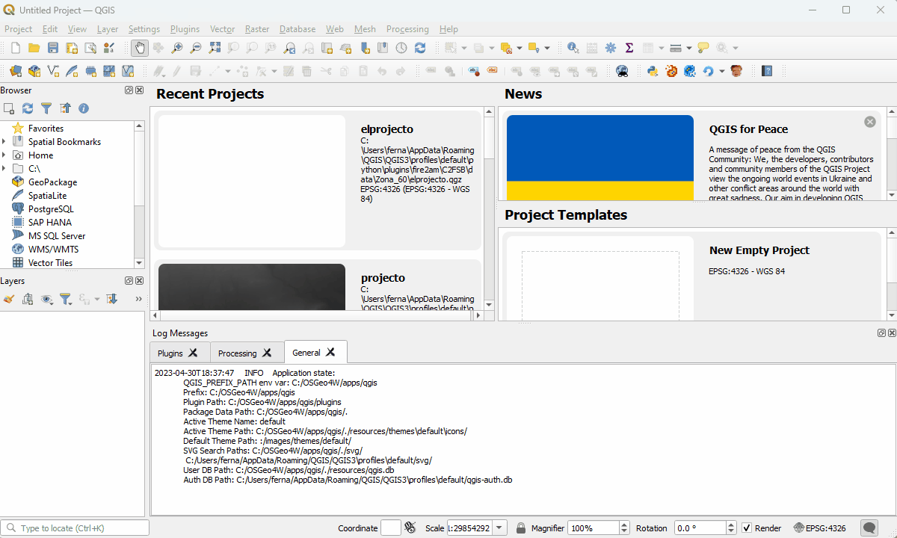

# Qgis Plugin Installation

## Overview
Go to [windows detailed instructions](#windows)

1. [Install/update QGIS](https://qgis.org)  
2. Install the plugin dependencies
3. Add fire2a [QGIS-plugin-repository](https://fdobad.github.io/qgis-processingplugin-template/plugins.xml) into QGIS plugins manager interface
4. Install the plugin

## Step 3 alternatives
3.B. Download & unzip a release from the repo [releases](https://github.com/fdobad/qgis-processingplugin-template/releases) section  
3.C. Fork or clone the [repo](https://github.com/fdobad/qgis-processingplugin-template) and contribute!
Both options must end up with this folder:
```
# linux (symbolic link it!)
~/.local/share/QGIS/QGIS3/profiles/default/python/plugins/processingplugin

# windows
%APPDATA%\QGIS\QGIS3\profiles\default\python\plugins\processingplugin
```

## Step 2 Installing dependencies
Two parts: pip install python requirements and MIP solvers  
### python
Save link as: [requirements.txt](https://raw.githubusercontent.com/fdobad/qgis-processingplugin-template/main/requirements.txt) (for developers [requirements.dev.txt](https://github.com/fdobad/qgis-processingplugin-template/blob/main/requirements.dev.txt))
```
$ mkdir ~/<your_qgis_env_path>
$ python3 -m venv --system-site-packages ~/<your_qgis_env_path>  
$ source ~/<your_qgis_env_path>/bin/activate
(your_env) $ pip install --upgrade pip wheel setuptools  
(your_env) $ pip install -r requirements.txt  
(your_env) $ pip install --upgrade matplotlib

# launch QGIS:
(your_env) $ qgis

# Optional tip: Make aliases to activate & launch
echo 'alias pyqgis="source ~/<your_qgis_env_path>/bin/activate"'>>~/.bashrc  
echo 'alias qgis="source ~/<your_qgis_env_path>/bin/activate && qgis"'>>~/.bashrc
```

### MIP solvers
```
# debian packages 3 solvers
sudo apt install coinor-cbc glpk scipy

TODO
# windows
# macOS
```

## Windows
1. Install or update QGIS, two alternatives:
   
    A. Download & install QGIS from: https://qgis.org/en/site/forusers/download.html#windows  
    or B. Open a terminal, run: `winget install --id OSGeo.QGIS` follow on screen instructions  

2. Install the plugin requirements (on qgis's python). If this fails there's a last resort [here](<#forcing python requirements in QGIS console>)

    2.1 Download [requirements.txt](https://github.com/fdobad/qgis-processingplugin-template/blob/main/requirements.txt)  
    2.2 Run "OsGeo4WShell" from the start menu  (Start > type 'osgeo' Enter)  
    2.3 Enter `pip install -r "%USERPROFILE%\Downloads\requirements.txt"` (Modify the path to requirements file if needed; tip: 2dary click to paste in terminal)  
   
3. Add fire2a's plugin repository:

    3.1 Open QGIS  
    3.2 Menu Bar: Plugins > Manage and Install Plugins... > Settings > Add... (button at the bottom right of Plugin Repositories section)  
    3.2 "Repository details" dialog opens. Fill inputs:  
        "Name": any, though "Fire2a" is suggested  
        "URL" input with "https://fdobad.github.io/qgis-processingplugin-template/plugins.xml"  
   Confirm (Ok button), repos will be reloaded and a success state should be seen from the fire2a repository

4. Install the plugin

   4.1 On the same "Plugins" dialog, click "All" on the left vertical tab.  
   4.2 Type "fire2am" on the Search...  
   4.2 Select it from the list  
   4.3 Click the install button  

| Animated steps 2, 3 & 4 |
| --- |
| 2. Install the plugin requirements (on QGIS's python) |
||
| 3. Add fire2a's plugin repository & 4. Install the plugin __(FOR ALL PLATFORMS!!)__ <a id="my-anchor"></a> |
||

## Forcing python requirements in QGIS console
The last resort but very discouraged method to installing packages for the QGIS python environment, inside QGIS:  
1. Launch the [python console](https://docs.qgis.org/2.18/en/docs/user_manual/plugins/python_console.html) by typing `Ctrl+Alt+P` or clicking on the python icon   
2. Write the following commands:  
```
import pip
pip.main(['install', 'my-package-name'])
```
Replace 'my-package-name' and repeat this line with each package from the [requirements.txt](https://raw.githubusercontent.com/fdobad/qgis-processingplugin-template/main/requirements.txt) file, ignore the warnings and restart QGIS.  

| force pip on python console |
| --- |
||

