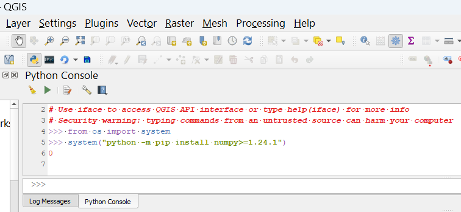

{: .warning}
QGIS may crash or brick itself

This last resort and very discouraged method to installing packages from within QGIS python environment itself:
1. Launch the [python console] by typing `Ctrl+Alt+P` or clicking on the python icon {: width="3%" }
2. Excute the following commands, making sure the list is up-to-date with [requirements.txt]:  
```
from os import system
system("python -m pip install numpy>=1.24.1")
system("python -m pip install pandas>=2.0.2")
system("python -m pip install scipy>=1.10.1")
system("python -m pip install pyomo>=6.7.0")
system("python -m pip install networkx>=2.7")
```
Each one should return `0`
3. Restart QGIS



<a href="README.html#install-fire2a-toolbox">back to install fire2a-toolbox</a>

---
[python console]: https://docs.qgis.org/latest/en/docs/user_manual/plugins/python_console.html
[requirements.txt]: https://raw.githubusercontent.com/fire2a/fire-analytics-qgis-processing-toolbox-plugin/main/fireanalyticstoolbox/requirements.txt 
