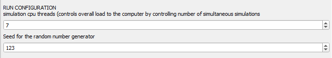
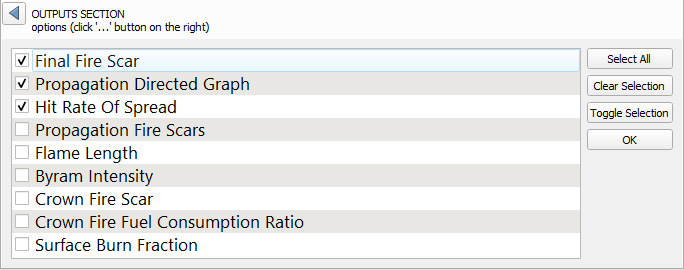
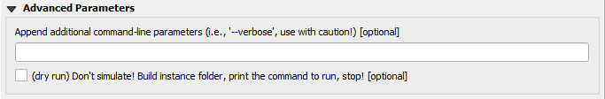
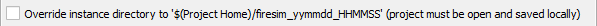

{: .no_toc}

  

    Table of contents
  

  {: .text-delta }
1. TOC
{:toc}

# Data preparation
## Rasters
* Prepared instances available with "instance downloader" algorithm
* All rasters (and project) must be projected in the same CRS, in squared meters
* Using the fuel raster as base, rasters must match:
    - In number of pixels in both direction
    - At most one pixel offset in each direction
    - Hence pixel size must be very close [~mm]

| rasters | purpose | units |
| --- | --- | --- |
| fuels | encode landscape | fuel model table |
| elevation | dem | meters |
| cbh | canopy base height is where the lowest branch is | meters |
| cbd | canopy bulk density | kg/m3 |
| ccf | canopy cover fraction is like cloud cover indicator | [0,1] |
| py | probability density map is to draw ignitions | [0,1] |

## Weather
**Weather.csv table specification:**
* minimal columns: `name,timestamp,wind-speed,wind-direction`
* rows: by default each row lasts one hour
* fuel model dependant columns:

Canada
: `Scenario,datetime,APCP,TMP,RH,WS,WD,FFMC,DMC,DC,ISI,BUI,FWI`  

Kitral
: `Instance,datetime,WS,WD,TMP,RH`  

Scott&Burgan
: `Scenario,datetime,WS,WD,FireScenario`  

* FireScenario was deprecated by "Live & Dead Fuel Moisture Content Scenario [1=dry..4=moist]"
* There's no need to be consistent with the timestamps, but isoformat `YYYY-MM-DDTHH:MM:SS` should be followed
* WIP: unifying weather formats, relying on column names instead of order to read them

<a href="#top">back to top</a>
{: style="text-align: right;"}

# Filling the dialog
The simulator dialog is divided in four main sections: *Landscape, ignitions, weather and outputs*. And two optional: run-configuration and advanced options.
Altough intuitive (e.g. match each dimensional unit shown in square brackets), each section is commented below:

## Landscape  
{: width="85%"}
* The surface fuel model must match the fuel raster codification (see [lookup tables])
* The style fuel raster checkbox not only "paints" using 'native:setlayerstyle' algorithm according to each [qml layer style], but also show the classification on the Layers panel
* Enabling crown fire behavior makes sense *even without canopy rasters because there are fixed standard numbers* for them according to the fuel codification (Only available in Canada's fuel model)

<a href="#top">back to top</a>
{: style="text-align: right;"}

## Ignitions  
{: width="85%"}
* When simulating **one or few simulations**, a detailed output is relevant (like **propagation digraph and propagation scars**)
* When simulating **hundreds or thousands**, mean and std.dev. statistics are more important than detailed output that can choke the computer unnecessarily (use **final scar** instead of propagation scars; propagation digraph is input for DPV and Centrality measures; but it can't be loaded into view!)
* There are 3 ways to generate ignitions:  
&nbsp; 0. Draw a **uniformly distributed** random but burnable pixel  
&nbsp; 1. Draw using a **probability map** raster  
&nbsp; 2. Specify a **point** and optionally a radius to specify a **circle** from where uniformly draw  
* If passing various points in the "single point layer", only the last[?] will be taken into consideration (see feature id (fid) in layer attribute table)
* Note that afterwards there's a random seed input, hence same seed implies drawing the same point(s sequence)

<a href="#top">back to top</a>
{: style="text-align: right;"}

## Weather  
{: width="85%"}
* The simulator assumes **constant weather parameters across the grid**, they can change over time, but not space
* These parameters are passed into the simulator using a `.csv` file
* In a regular simulation **each row lasts 1 hour**, when the rows end, the simulation ends
* There are two options:  
&nbsp; 0. Using just one `Weather.csv`  
&nbsp; 1. Drawing at random from a directory `Weathers/WeatherN.csv : N = 1,2,...` correlatively named 
* WIP: A weather database; meanwhile weathers can be obtained from *weather.org from any location from 1970 until present day*  

back to <a href="#weather">weather spec.</a> \| <a href="#top">top</a>
{: style="text-align: right;"}

## Run Configuration  
{: width="85%"}
* Only lower the simulation cpu threads if you plan to keep working on something else while the simulations run in the background (for office or web-browsing you'll never need more than 2)  
* Keeping track of the seed yields reproducibility for all generated random numbers  

<a href="#top">back to top</a>
{: style="text-align: right;"}

## Outputs
This section has three main parts: options, advanced and destination directories.
{: width="85%"}  

### Options
* Access the multiple selection by clicking the `...` on the right
{: width="85%"}  
* Most outputs adapt according to being 1 or >1 simulations
* When simulating **one or few simulations**, a detailed output is relevant (like **propagation digraph and propagation scars**)
* When simulating **hundreds or thousands**, mean and std.dev. statistics are more important than detailed output that can choke the computer unnecessarily (use **final scar** instead of propagation scars; propagation digraph is input for DPV and Centrality measures; but it can't be loaded into view!)

| output name  | unit-type | description |
|:-------------|:------------------|:------|
| Final Fire Scars | raster `0,1` |  |
| Propagation Directed Graph | vector lines `periods` | edges labeled with simulation event time |
| Hit Rate Of Spread | raster float32 `m/m` | multiband x simulation and bi-band mean&std |
| Propagation Fire Scars | polygons | _animate adding the column_ `=now()+ make_interval(hours:=time)` |
| Flame Length| raster float32 `m` | multiband x simulation and bi-band mean&std |
| Byram Fireline Intensity | raster float32 `kW/m` | multiband x simulation and bi-band mean&std |
| Crown Fire Scar | raster `0,1` | multiband x simulation and bi-band mean&std |
| Crown Fire Fuel Consumption Ratio raster | `0,1` | multiband x simulation and bi-band mean&std |
| Surface Burn Fraction raster | `0,1` | multiband x simulation and bi-band mean&std |

<a href="#top">back to top</a>
{: style="text-align: right;"}

### Advanced options
* 

Un/Fold the block using the triangle
 at the left of Advanced Parameters
 
{: width="85%"}
* Any~~thing~~ **command line parameters can be appended**, refer to [Cell2Fire.ReadArgs.cpp](https://github.com/fire2a/C2F-W/blob/main/Cell2FireC/ReadArgs.cpp#L40), and [cell2fire.py.ParseArgs](https://github.com/fire2a/C2F-W/blob/main/Cell2FireC/cell2fire.py#L19) for documentation
* Dry run is useful for building the instance folder and getting the full command line that would be executed, as a way to **verify or modify the instance before running**
    1. Windows users must open OSGeo4W shell before running cell2fire.py
    2. Change directory to `path` before running the command

<a href="#top">back to top</a>
{: style="text-align: right;"}

### Destination directories: 
* The (Cell2)Fire Simulator defines input & outputs (instance & results) directories, reducing complexity by always naming files the same; Fire2a-toolbox takes care of builds these directories and writing files with the proper names [and formats... coming soon]. 
* **tmp means no worries**: By default QGIS processing algorithms are ran in memory and/or written to temporary directories; *upside always start from a clean slate and OS assited cleaning up, avoid cloud drives messing up; but the downside is being a bit cumbersome to reach those temporary locations*. The "Save All" plugin automatically encodes and save all currently loaded layers wherever you choose, use it after loading the results, and never worry about specifying directories.
* There are 3 -mutually exclusive- strategies specifying where to build instance & results directories:

Temporary
: Don't fill anything, recommended! (default empty)

Manually
: specify them: by absolute path o relative to user's home[?]

Instance along project
: A directory named `firesim_YYMMDD_HHMMSS` will be created; the project must be saved [in a location without spaces in its path]

Results inside Instance
: A directory named `results` will be created inside Instance (default)

<a href="#top">back to top</a>
{: style="text-align: right;"}

# Full Dialog 
{: width="85%"}
       
---
[lookup tables]: https://github.com/fire2a/fire-analytics-qgis-processing-toolbox-plugin/tree/main/fireanalyticstoolbox/simulator
[qml layer style]: https://github.com/fire2a/fire-analytics-qgis-processing-toolbox-plugin/tree/main/fireanalyticstoolbox/simulator
