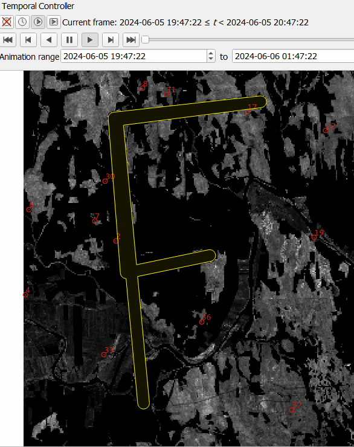

# Creating FireBreaks

Cell2FireW accepts a csv.file defining non-burnable cells, this is easier than modifying the fuels raster every time.

Even friendlier, the toolbox implements parsing the 1 values of a raster to write and pass it to the simulator.

{: width="32%" }

## Steps

1. Create a raster with the same dimensions as the instance
2. Put ones in the cells you want to be unburnable, this can be achieved 'painting' using serval, or by the output of one of our decision optimization algorithms.
3. Select the created raster into the 'Firebreak' input dropdown

{: width="90%" }

## Details

Cell2Fire-W simulator features placing firebreaks (that internally are represented as unburnable cells); making it easier than to manually create a new fuels raster for every firebreak experiment/simulation.

This is done by appending a `.csv` file to the simulation command. For example: `--FirebreakCells fbv.csv`, containing:

        Year,Ncell
        1,1,81,161,162

Values represents an "L" shaped firebreak: topleft cell is 1, the one below 81, below 161, to the right 162. (in a 80 pixels width raster)

Headers are: Year, Ncell.  
The first column always is Year, 1 (as CFW-W only supports one fire before resetting the landscape).  
Unburnable values are placed as a row of cells id (starting from 1)

